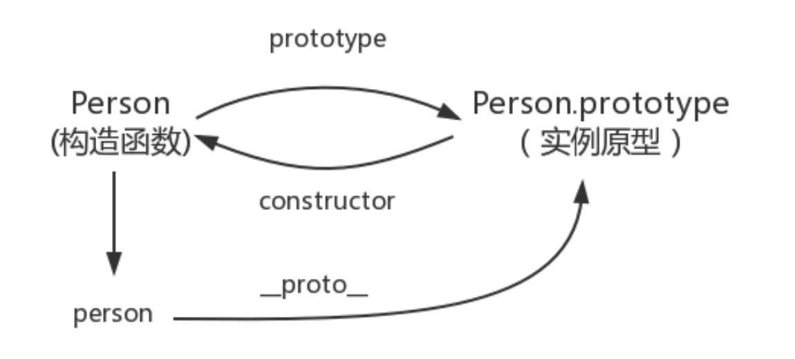

## 原型和原型链

### prototype

prototype 是函数才会有的属性

```js
function test1() {
  function Person() {}
  // prototype是函数才会有的属性
  Person.prototype.name = 'Kevin'
  var person1 = new Person()
  var person2 = new Person()
  console.log(person1.name) // Kevin
  console.log(person2.name) // Kevin
}
test1()
```

函数的 prototype 属性指向了一个对象，这个对象正是调用该构造函数而创建的实例的原型，也就是这个例子中 person1 和 person2 的原型
什么是原型：每一个 JavaScript 对象(null 除外)在创建的时候都会与之关联另一个对象，这个对象就是我们所说的原型，每一个对象都会从原型上 "继承" 属性

### \_\_proto\_\_

每一个 JavaScript 对象(除了 null)都具有一个属性: `__proto__`，这个属性会指向该对象的原型

```js
function test1() {
  function Person() {}

  var person1 = new Person()
  console.log(person1.__proto__ === Person.prototype) // true
}
test1()
```

### constructor

每个原型都有一个 `constructor` 属性指向关联的构造函数

```js
function Person() {}

console.log(Person === Person.prototype.constructor) // true
```

综上可以得到如下关系图



1. 构造函数的 `prototype` 指向实例的原型
2. 实例的 `__proto__` 指向实例的原型
3. 实例原型的 `constructor` 指向构造函数

```js
function test2() {
  function Person() {}

  var person = new Person()

  console.log(person.__proto__ == Person.prototype) // true
  console.log(Person.prototype.constructor == Person) // true
  // getPrototypeOf 可以获得对象的原型
  console.log(Object.getPrototypeOf(person), Person.prototype)
  console.log(Object.getPrototypeOf(person) === Person.prototype) // true
}
test2()
```

### 四个概念

1. js 分为**函数对象**和**普通对象**，每个对象都有 `__proto__` 属性，但是只有函数对象才有 `prototype` 属性
2. Object、Function 都是 js 内置的**函数**，类似的还有 Array、RegExp、Date、Boolean、Number、String
3. 属性 `__proto__` 是一个对象，它有两个属性：`constructor` 和 `__proto__`
4. 原型对象 `prototype` 有一个默认的 `constructor` 属性，用于记录实例是由哪个构造函数创建的

### 两个准则

1. 原型对象（即 Person.prototype）的 constructor 指向构造函数本身

```js
Person.prototype.constructor == Person
```

2. 实例的 `__proto__` 和原型对象指向同一个地方

```js
const person = new Person()
person.__proto__ === Person.prototype
```

根据以上概念，判断如下代码：

```js
function test3() {
  // Function
  function Foo() {}
  let f1 = new Foo()
  let f2 = new Foo()

  // 实例的 __proto__ 等于构造函数的 prototype
  console.log('实例的 __proto__ 等于构造函数的 prototype')
  console.log('f1.__proto__ === Foo.prototype', f1.__proto__ === Foo.prototype)
  console.log('f2.__proto__ === Foo.prototype', f2.__proto__ === Foo.prototype)

  // 原型对象的 __proto__ 指向 Object.prototype
  console.log('原型对象的 __proto__ 指向 Object.prototype')
  console.log('Foo.prototype.__proto__ === Object.prototype', Foo.prototype.__proto__ === Object.prototype)
  console.log('Object.prototype.__proto__ === null', Object.prototype.__proto__ === null)

  // 构造函数的 prototype 的 constructor 指向构造函数本身
  console.log('构造函数的 prototype 的 constructor 指向构造函数本身')
  console.log('Foo.prototype.constructor === Foo', Foo.prototype.constructor === Foo)

  // 函数对象是由内置函数 Function 创建的
  console.log('函数对象是由内置函数 Function 创建的, Foo 是 Function 的实例')
  console.log('Foo.__proto__ === Function.prototype', Foo.__proto__ === Function.prototype)

  console.log('Function.prototype本质也是普通对象')
  console.log('Function.prototype.__proto__ === Object.prototype', Function.prototype.__proto__ === Object.prototype)

  // Object
  let o1 = new Object()
  let o2 = new Object()

  console.log('实例的 __proto__ 等于构造函数的 prototype')
  console.log('o1.__proto__ === Object.prototype', o1.__proto__ === Object.prototype)
  console.log('o2.__proto__ === Object.prototype', o2.__proto__ === Object.prototype)

  console.log('Object.prototype.__proto__ === null', Object.prototype.__proto__ === null)
  console.log('Object.prototype.constructor === Object', Object.prototype.constructor === Object)

  // 所有函数的 __proto__  都和 Function.prototype 指向同一个地方
  console.log('所有函数的 __proto__  都和 Function.prototype 指向同一个地方')
  console.log('Object.__proto__ === Function.prototype', Object.__proto__ === Function.prototype)
  console.log('Function.prototype.__proto__ === Object.prototype', Function.prototype.__proto__ === Object.prototype)

  console.log('相当于 Function 是 Function 自己的实例')
  console.log('Function.__proto__ === Function.prototype', Function.__proto__ === Function.prototype)
  console.log('Function.prototype.constructor === Function', Function.prototype.constructor === Function)
}
test3()
```

### 总结

除了 Object 的原型对象 `Object.prototype` 的 `__proto__` 指向 null

其他内置函数对象的原型对象（例如：Array.prototype）和自定义构造函数的 ` __proto__` 都指向 `Object.prototype`

因为原型对象本身也是普通对象

```js
Object.prototype.__proto__ === null // true
Array.prototype.__proto__ === Object.prototype // true
Foo.prototype.__proto__ === Object.prototype // true
```


上图为原型链经典示意图，学习了上述概念之后，再看这张图就能一目了然了。

**原型** 是面向对象的另一种实现方式，其他常见语言中一般使用 **类** 来实现面向对象。

个人理解原型就像是父类，原型链就是一层层的继承关系，本质都是为了属性共享和方法复用
