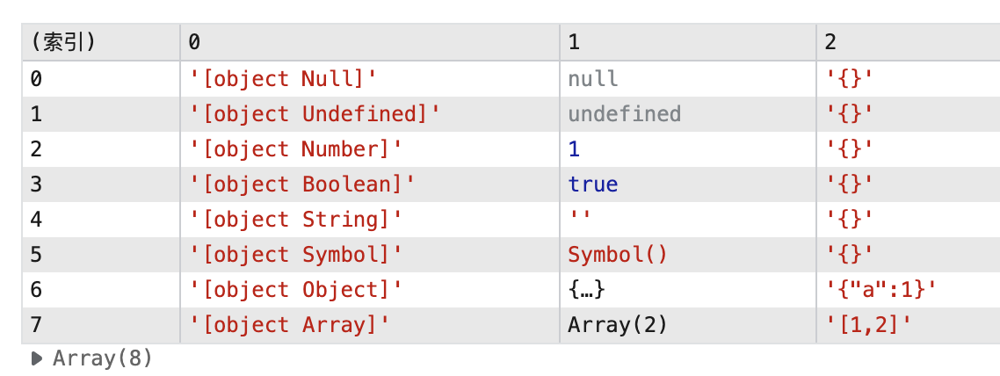

# 构造函数的返回值和 new 实例的关系

通过代码验证一下:

```js
const list = [null, undefined, 1, true, "", Symbol(), { a: 1 }, [1, 2]]
  .map((v) => [
    v,
    function () {
      return v;
    },
  ])
  .map(([ret, MyConstructor]) => [
    Object.prototype.toString.call(ret),
    ret,
    JSON.stringify(new MyConstructor())
  ])

console.table(list)
```



通过上图可以总结出如下结论：

- 构造函数返回值为基础类型，则 new 的实例为空对象
- 构造函数返回值为引用类型，则 new 的实例为该构造函数的返回值

