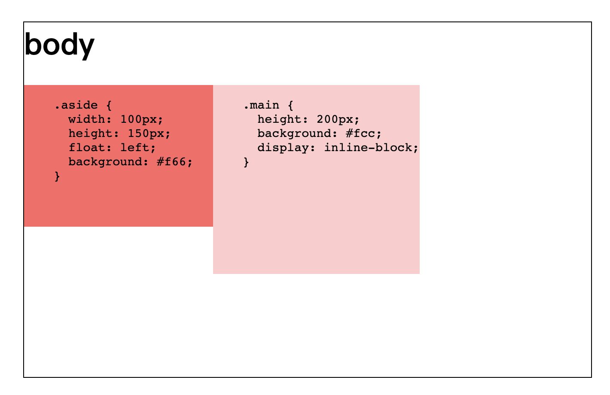

## 什么是 BFC

BFC 全称：Block Formatting Context （块级格式化上下文）= `block-level box` + ` Formatting Context`

`block-level box` 即为块级元素，与之对应的即为行内元素 `inline-level box`

BFC 是一个独立的渲染区域，只有块级元素参与， 它规定了内部的块级元素如何布局，并且这个区域与外部完全隔离，不会互相影响

### 如何生成 BFC

CSS2.1 中规定满足下列 CSS 声明之一的元素会生成 BFC：

- 根元素
- float 的值不为 none
- overflow 的值不为 visible
- display 的值是 inline-block、flex、inline-flex、table-cell、table-caption
- position 的值不是 static、relative

### BFC 的布局规则

1、默认内部的块级元素会在垂直方向一个接一个地放置，每个块级元素独占一行

2、属于同一个 BFC 的两个相邻块级元素在垂直方向上的 margin 会发生重叠，以较大的那个为准，但水平方向的不会

3、BFC 的区域不会与 float 的元素区域重叠

4、计算 BFC 的高度时，内部浮动子元素也参与计算

### BFC 的应用

1、防止两个块级元素的 margin 重叠：因为两个 BFC 区域互不影响

2、清除内部元素浮动：因为 BFC 区域计算高度时，内部浮动元素也参与计算

3、自适应两三栏布局：因为 BFC 的区域不会与 float 的元素区域重叠

### 总结

BFC 就是页面上一个完全隔离的独立容器，容器里的元素和外界不会互相影响。

