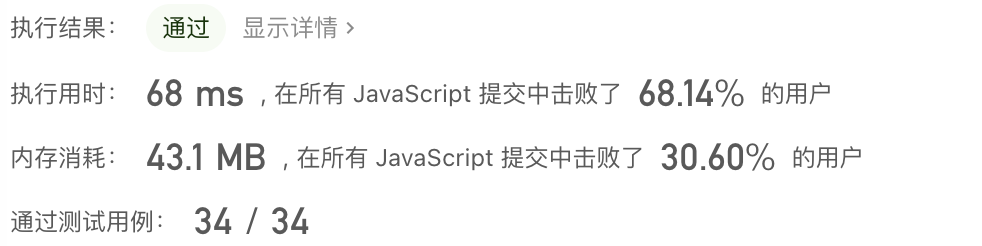

## 二叉树的层序遍历

### 题目描述
给你一颗二叉树, 然后从左边照过来一束光, 返回所有能被光照到的节点
例如：


上述二叉树，从左侧看，可以看到的节点为 [1,2,4,7]


### 题目分析

我们可以发现，这其实就是每一层的第一个节点，那么就可以使用二叉树的层序遍历解决。

一般二叉树的层序遍历都可以借助一个队列来临时存储每一层的节点，例如：

1、首先第一层节点入队列，此时队列的长度为 1，那么当前层需要遍历 1 次，出队一个节点，然后将这个节点的左右孩子入队

2、此时队列长度为 2，那么当前层需要遍历 2 次，第一次：出队 2，2 的左右孩子入队；第二次：出队 3，3 的孩子入队

3、初始层数为 0，每层遍历完毕，层数+1，直到队列为空


### 代码实现

```js
/**
 * Definition for a binary tree node.
 * function TreeNode(val, left, right) {
 *     this.val = (val===undefined ? 0 : val)
 *     this.left = (left===undefined ? null : left)
 *     this.right = (right===undefined ? null : right)
 * }
 */
/**
 * @param {TreeNode} root
 * @return {number[][]}
 */
var levelOrder = function (root) {
    if (!root) return []
  	// 首先根节点入队
    const queue = []
    queue.push(root)
    const res = []
    // 记根节点所在层为第 0 层
    let level = 0
    while (queue.length) {
        // 获取当前层的节点个数
        const curLevelSize = queue.length
        // 初始化当前层的数组，用于保存当前层的节点
        res[level] = []
        // 当前层有几个节点，就需要遍历几次
        for (let i = 0; i < curLevelSize; i++) {
            // 每次遍历出队一个节点
            const node = queue.shift()
            // 把这个节点加到当前层的数组中
            res[level].push(node.val)
            // 左右孩子入队
            if (node.left) queue.push(node.left)
            if (node.right) queue.push(node.right)
        }
        // 当前层遍历完毕，层数+1
        level++
    }
    return res
};
```


### 执行结果和复杂度分析




时间复杂度：O(n)，每个节点都进行了一次遍历

空间复杂度：O(n)，队列中的元素个数不超过 n


