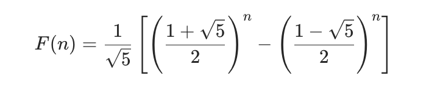

## 斐波那契数列


### 题目描述

斐波那契数 （通常用 F(n) 表示）形成的序列称为 斐波那契数列 。该数列由 0 和 1 开始，后面的每一项数字都是前面两项数字的和。

也就是：

```
F(0) = 0，F(1) = 1
F(n) = F(n - 1) + F(n - 2)，其中 n > 1
```

给定 n ，请计算 F(n) 


### 题目分析与解答

#### 1. 递归

该数列从 0 和 1 开始，每次计算都只需要前面的两项即可，根据上面给的公式，首先可以使用递归解决

```js
var fib = function (n) {
  // 1. 递归
  if (n < 2) return n
  return fib(n - 1) + fib(n - 2)
}
```

但是这会产生大量重复计算，例如：

```
f(3) = f(2) + f(1)
f(4) = f(3) + f(2)
```

这里的 f(2) 就重复计算了


#### 2. 数组递推

我们可以把计算过的数字使用数组缓存起来，避免重复计算

```js
var fib = function (n) {
  // 2. 数组递推
  const arr = [0, 1]
  for (let i = 2; i <= n; i++) {
    arr[i] = arr[i - 1] + arr[i - 2]
  }
  return arr[n]
}
```

但是这样最终数组的长度是 n，而我们需要的其实只有最后一项，前面的空间都浪费了

所以我们其实可以只使用两个变量来缓存前两项即可


#### 3. 滚动数组的思想

```js
var fib = function (n) {
  if (n < 2) return n
  let p = 0
  let q = 1
  let sum = 1
  for (let i = 3; i <= n; i++) {
    p = q
    q = sum
    sum = p + q
  }
  return sum
}
```

这里就三个变量 p、q、sum，分别代表数列中连续的 3 项，例如：

初始化如下

```
  0  1  1  2  3  5...
  p  q  sum
```

现在要计算第 3 个，也就是 2，那么就需要

1. p 往前一步，等于 q（1）
2. q 往前一步，等于 sum（1）
3. sum 往前一步，等于 p + q（2）

这样时间复杂度为 O(n)：循环不超过 n 次；空间复杂度 O(1)，只使用了 3 个变量


#### 4. 通项公式

其实斐波那契数列的计算可以推导出一个通项公式，直接使用公式计算即可



```js

var fib = function (n) {
  const sqrt5 = Math.sqrt(5)
  const fibN = Math.pow((1 + sqrt5) / 2, n) - Math.pow((1 - sqrt5) / 2, n)
  return Math.round(fibN / sqrt5)
}
```


