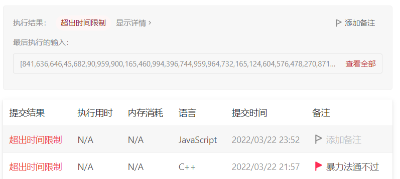
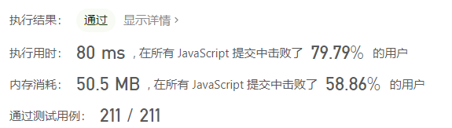
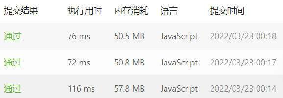

## 买卖股票的最佳时机

来源：力扣（LeetCode）
链接：https://leetcode-cn.com/problems/best-time-to-buy-and-sell-stock

### 题目描述

给定一个数组 prices ，它的第 i 个元素 prices[i] 表示一支给定股票第 i 天的价格。

你只能选择 某一天 买入这只股票，并选择在 未来的某一个不同的日子 卖出该股票。设计一个算法来计算你所能获取的最大利润。

返回你可以从这笔交易中获取的最大利润。如果你不能获取任何利润，返回 0

例如：

```
输入：[7,1,5,3,6,4]
输出：5
解释：在第 2 天（股票价格 = 1）的时候买入，在第 5 天（股票价格 = 6）的时候卖出，最大利润 = 6-1 = 5 。
     注意利润不能是 7-1 = 6, 因为卖出价格需要大于买入价格；同时，你不能在买入前卖出股票。
```

### 题目解析

这是一道简单题，我们先用最简单的思维去想：

#### 1. 暴力枚举

因为买入在前，卖出在后，那么针对每一天的价格，我们计算出它后面的价格和它的差值，然后取最大的，即为答案

因此可以两层枚举 for 循环先干起来

```js
/**
 * @param {number[]} prices
 * @return {number}
 */
var maxProfit = function (prices) {
  let max = 0
  const len = prices.length
  for (let i = 0; i < len; ++i) {
    for (let j = i + 1; j < len; ++j) {
      const val = prices[j] - prices[i]
      if (val > max) max = val
    }
  }
  return max
}
```

但是悲剧发生了



暴力解法超时了！我还以为是 JS 性能不行，换了 C++ 也不行！

我们继续观察发现，如果第二天的价格小于第一天，那肯定是赔钱的！这种情况可以直接跳过，于是优化代码如下：

```js
var maxProfit = function (prices) {
  let max = 0
  const len = prices.length
  for (let i = 0; i < len; ++i) {
    // 第二天的价格必须大于第一天
    for (let j = i + 1; j < len && prices[j] > prices[i]; ++j) {
      const val = prices[j] - prices[i]
      if (val > max) max = val
    }
  }
  return max
}
```

可以通过哈哈



但是估计测试用例再大点，又不行了。所以还是得另寻他路

#### 2. 动态规划

如果我们计算出每一天卖出股票会得到的最大收益，再取其中最大的，即为答案。

在第 i 天卖掉股票的最大收益 = 第 i 天的股票价格 - 前 i-1 天的最低价格，即：

$$
f(i) = prices[i] - min
$$

我们只需要算出这个 min 即可。设 dp[i] 为以第 i 天结尾的价格数组中最小的价格，则有：

$$
dp[i] = Min(dp[i-1], prices[i])
$$

根据上式可得如下代码：

```js
/**
 * @param {number[]} prices
 * @return {number}
 */
var maxProfit = function (prices) {
  const dp = [prices[0]]
  let max = 0
  for (let i = 1; i < prices.length; ++i) {
    dp[i] = Math.min(dp[i - 1], prices[i])
    max = Math.max(prices[i] - dp[i], max)
  }
  return max
}
```

我们发现并不需要将每个价格前面数组的最小值都存起来，只需要一个变量来维护即可，可改进代码如下：

```js
var maxProfit = function (prices) {
  let min = prices[0]
  let max = 0
  for (let i = 1; i < prices.length; ++i) {
    min = Math.min(min, prices[i])
    max = Math.max(prices[i] - min, max)
  }
  return max
}
```

时间和空间均有提升！



时间复杂度：O(n)，只遍历一轮

空间复杂度：O(1)，只用了常数个变量维护最大最小值
