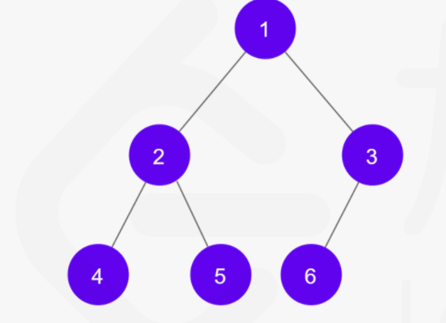

## 二叉树的中序遍历

LeetCode 链接: https://leetcode-cn.com/problems/binary-tree-inorder-traversal/

### 题目描述

给定一个二叉树的根节点 `root` ，返回它的 **中序** 遍历。

中序遍历的定义为：左根右，即优先访问左子树，左子树为空时再访问根节点，最后访问右子树

例如：



这棵二叉树的中序遍历结果为 [4, 2, 5, 1, 6, 3]

### 题目解析和代码

二叉树的前中后序遍历一般都可以使用递归来解决，只需修改访问节点的位置即可，例如中序遍历，就是在递归遍历左子树之后访问节点

#### 1. 递归

```js
var inorderTraversal = function (root) {
  const res = []
  // 递归函数
  const traverse = (root) => {
    if (!root) return null
    // 左根右
    traverse(root.left)
    res.push(root.val)
    traverse(root.right)
  }
  traverse(root)
  return res
}
```

一般可以使用递归的问题，我们都可以使用栈来模拟

#### 2. 循环 + 栈

不断遍历左节点，并将其入栈，遍历到叶子节点时，即可进行出栈，出栈元素加入到结果里，再继续访问其右子树 ... 直到栈为空

```js
var inorderTraversal = function (root) {
  const res = []
  const stk = []
  while (stk.length || root) {
    // 先不断遍历左节点，并入栈
    while (root) {
      stk.push(root)
      root = root.left
    }
    // 遍历到叶子节点了，即可出栈
    const node = stk.pop()
    // 将出栈节点加入结果
    res.push(node.val)
    // 然后访问其右节点
    root = node.right
  }
  return res
}
```

时间空间复杂度都为 O(n)，n 为节点个数
