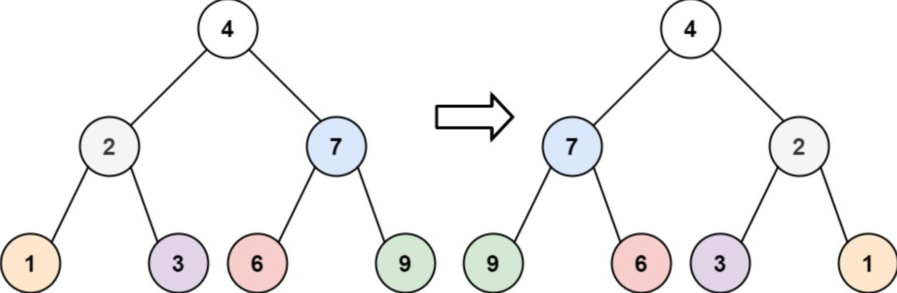

## 翻转二叉树

来源：力扣（LeetCode）
链接：https://leetcode-cn.com/problems/invert-binary-tree

### 题目描述

给你一棵二叉树的根节点 root ，翻转这棵二叉树，并返回其根节点。

示例 1：



输入：root = [4,2,7,1,3,6,9]
输出：[4,7,2,9,6,3,1]

### 题目分析

翻转二叉树就是将每个节点的左右子树进行交换

思路就是遍历每个节点，将其左右节点交换，遍历完毕也就翻转完成了

一般二叉树的遍历可以使用递归，因此可以写出如下代码：

#### 1. 递归

```js
/**
 * Definition for a binary tree node.
 * function TreeNode(val, left, right) {
 *     this.val = (val===undefined ? 0 : val)
 *     this.left = (left===undefined ? null : left)
 *     this.right = (right===undefined ? null : right)
 * }
 */
/**
 * @param {TreeNode} root
 * @return {TreeNode}
 */
var invertTree = function (root) {
  if (!root) return null
  // 交换左右节点
  const [left, right] = [root.left, root.right]
  root.right = left
  root.left = right
  // 递归遍历左右子树
  invertTree(root.left)
  invertTree(root.right)
  return root
}
```

交换节点的代码可以放在递归前，就是前序遍历；也可以放在递归后，就是后序遍历：

```js
// 递归遍历左右子树
invertTree(root.left)
invertTree(root.right)
// 交换左右节点
const [left, right] = [root.left, root.right]
root.right = left
root.left = right
```

既然可以使用递归遍历，那也可以使用迭代+队列/栈的方式遍历

#### 2. 层序遍历

```js
/**
 * Definition for a binary tree node.
 * function TreeNode(val, left, right) {
 *     this.val = (val===undefined ? 0 : val)
 *     this.left = (left===undefined ? null : left)
 *     this.right = (right===undefined ? null : right)
 * }
 */
/**
 * @param {TreeNode} root
 * @return {TreeNode}
 */
var invertTree = function (root) {
  if (!root) return null
  const head = root
  const queue = [root]
  while (queue.length) {
    const size = queue.length
    // 层序遍历的关键：当前层有几个节点，就遍历几次
    for (let i = 0; i < size; i++) {
      root = queue.shift()
      // 交换当前出队节点的左右子树
      const [left, right] = [root.left, root.right]
      root.right = left
      root.left = right
      // 左右节点入队
      if (left) queue.push(left)
      if (right) queue.push(right)
    }
  }
  return head
}
```

时间空间复杂度都是O(n)，因为遍历 n 个节点，递归深度或队列长度不会超过 n

