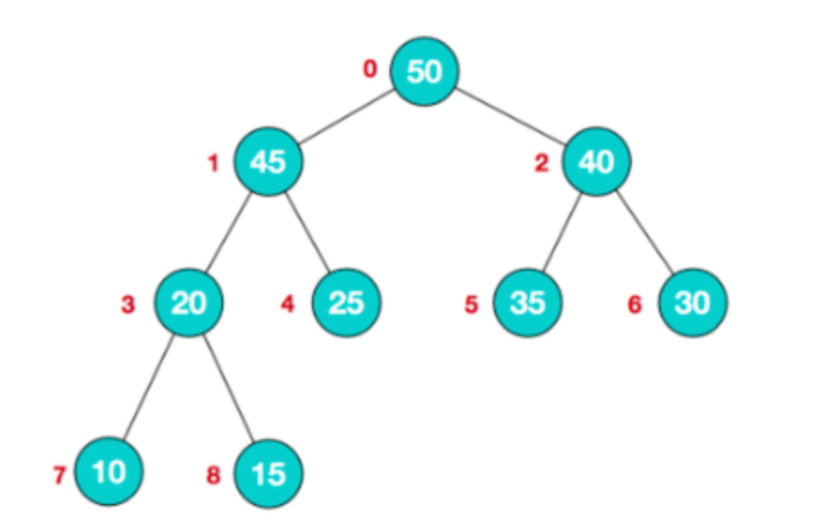

## 数组中第 K 大的元素

来源：力扣（LeetCode）  
链接：https://leetcode-cn.com/problems/kth-largest-element-in-an-array

### 题目描述

给定整数数组 nums 和整数 k，请返回数组中第 k 个最大的元素。

请注意，你需要找的是数组排序后的第 k 个最大的元素，而不是第 k 个不同的元素。

示例 1:

```
输入: [3,2,1,5,6,4] 和 k = 2
输出: 5
```

### 题目分析

根据题目，一般我们都会想到先进行降序排序，第 k 个元素即为答案。

但是因为我们只要第 k 大的元素，其实不用对整个数组进行排序。

一般这种 topK 的问题都可以使用 **堆** 这种数据结构来解决。

#### 堆

堆是具有以下性质的完全二叉树：

大顶堆：每个节点的值都 **大于或等于** 其左右孩子节点的值

小顶堆：每个节点的值都 **小于或等于** 其左右孩子节点的值

> 注：没有要求左右值的大小关系

使用数组顺序存储二叉树（其实就是二叉树的层序遍历序列）的特点：

- 第 n 个元素的左子节点下标为 **2n+1**
- 第 n 个元素的右子节点下标为 **2n+2**
- 第 n 个元素的父节点下标为 **(n-1)/2**
- 最后一个非叶子节点的下标为 `Math.floor(arr.length / 2) - 1`



根据大顶堆的特点，我们只需要将堆顶元素与最后一个元素交换 k-1 次，当前的堆顶元素即为第 k 大的元素了。

主要流程：

1. 将数组 nums 构建为一个大顶堆

   1.1 从最后一个非叶子节点开始构建

   1.2 根据当前节点的下标，计算其左右子节点的下标

   1.3 如果左右节点值大于当前节点，即与之交换

   1.4 递归构建子树

2. 将数组最后一个元素与堆顶元素进行交换，然后将除了最后一个元素的数组继续调整为一个大顶堆。如此循环 k-1 次，此时数组第一个元素即为第 k 大的元素。

### 代码实现

```js
/**
 * @param {number[]} nums
 * @param {number} k
 * @return {number}
 */
var findKthLargest = function (nums, k) {
  // 构建一个大顶堆，堆顶元素出堆 k-1 次后，堆顶元素即为第 k 大的元素
  let heapSize = nums.length

  // 自动调整为大顶堆
  const maxHeapify = (nums, curIndex, heapSize) => {
    // 计算当前节点的左右子节点下标
    const left = 2 * curIndex + 1
    const right = left + 1
    let tmpCur = curIndex
    if (left < heapSize && nums[left] > nums[tmpCur]) {
      tmpCur = left
    }
    if (right < heapSize && nums[right] > nums[tmpCur]) {
      tmpCur = right
    }
    // 说明需要交换节点的值
    if (tmpCur !== curIndex) {
      ;[nums[tmpCur], nums[curIndex]] = [nums[curIndex], nums[tmpCur]]
      maxHeapify(nums, tmpCur, heapSize)
    }
  }

  const buildMaxHeap = (nums, heapSize) => {
    // 从最后一个非叶子节点开始，构建一个大顶堆
    for (let i = Math.floor(heapSize / 2) - 1; i >= 0; --i) {
      maxHeapify(nums, i, heapSize)
    }
  }

  buildMaxHeap(nums, heapSize)
  // 最后一个节点与堆顶节点交换 k-1 次
  for (let i = nums.length - 1; i > nums.length - k; --i) {
    ;[nums[i], nums[0]] = [nums[0], nums[i]]
    --heapSize
    maxHeapify(nums, 0, heapSize)
  }
  // 当前堆顶元素即为第 k 大元素
  return nums[0]
}
```

#### 复杂度分析

时间复杂度：O(nlogn)，建堆的时间代价是 O(n)，删除的总代价是 O(klogn)，因为 k<n，故渐进时间复杂为

$$
O(n + klogn) =O(nlogn)
$$

空间复杂度：O(logn)，即递归使用栈的空间
