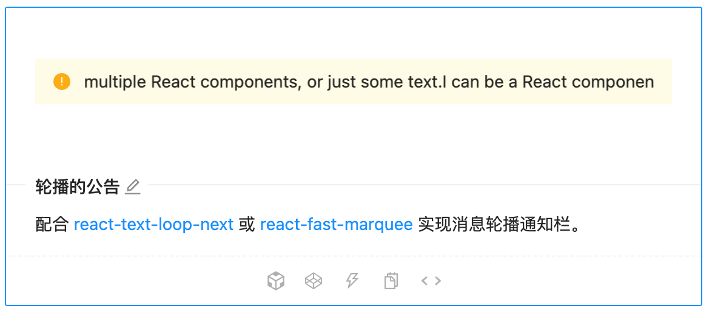

工作中需要实现一个通知公告的自动轮播功能，经过调研后找到了如下几种解决方案，在此记录一下

### 1. Antd 的 Alert 组件与 [react-fast-marquee](https://github.com/justin-chu/react-fast-marquee) 结合使用

https://ant-design.gitee.io/components/alert-cn/#components-alert-demo-loop-banner



### 2. jQuery 插件 txtscroll.js

https://www.jq22.com/demo/txtscroll201812202301/

### 3. 使用 CSS 属性 transition-duration、transform 实现的通知消息轮播组件

```react
export default function TextScroll(props) {
  const headway = 40 // 内容间隔
  const speed = 20 // 滚动的速度
  const [contentStyle, setContentStyle] = useState({
    transitionDuration: '0s',
    transform: 'translateX(0px)',
  })
  const [animateFlag, setAnimationFlag] = useState(false)
  const timer = useRef()
  const noticeBarRef = useRef()
  const contentRef = useRef()

  const init = () => {
    // 容器宽度
    const barWidth = noticeBarRef.current.offsetWidth
    // 内容宽度
    const contentWidth = contentRef.current.offsetWidth

    if (contentWidth >= barWidth) {
      // 内容宽度 + 间距
      setAnimationFlag(true)
      const time = contentWidth / speed
      const width = contentWidth + headway

      startAnimate(time, width)
      timer.current = setInterval(() => {
        startAnimate(time, width)
      }, time * 1100)
    }
  }

  const startAnimate = (time, contentWidth) => {
    // 动画初始状态
    setContentStyle({
      transitionDuration: '0s',
      transform: 'translateX(0px)',
    })
    // 动画开启 time 动画时间 contentWidth 动画长度
    setTimeout(() => {
      setContentStyle({
        transitionDuration: `${time}s`,
        transform: `translateX(-${contentWidth}px)`,
      })
    }, 100)
  }

  useEffect(() => {
    init()
    return () => {
      clearInterval(timer.current)
      timer.current = null
    }
  }, [])

  return (
    <div>
      <div className='notice-bar' ref={noticeBarRef}>
        <div className='notice-bar-content' ref={contentRef} style={contentStyle}>
          {props.children}
          {animateFlag && (
            <>
              <span className='content-headway' style={{ width: `${headway}px` }}></span>
              {props.children}
            </>
          )}
        </div>
      </div>
    </div>
  )
}
```

```less
.notice-bar {
  position: relative;
  display: flex;
  flex: 1;
  padding: 12px;
  width: 200px;
  height: 100%;
  border: 1px solid lightblue;
  align-items: center;
  overflow: hidden;

  &::after {
    content: '';
    width: 30px;
    height: 100%;
    position: absolute;
    right: 0;
    background: linear-gradient(270deg, #ffffff 0%, rgba(255, 255, 255, 0) 100%);
  }

  .notice-bar-content {
    position: absolute;
    white-space: nowrap;
    transition-timing-function: linear;

    .content-headway {
      display: inline-block;
    }
  }
}
```

完整代码：https://codesandbox.io/s/heuristic-feistel-ogm2c1?file=/src/App.js
