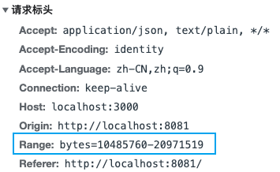
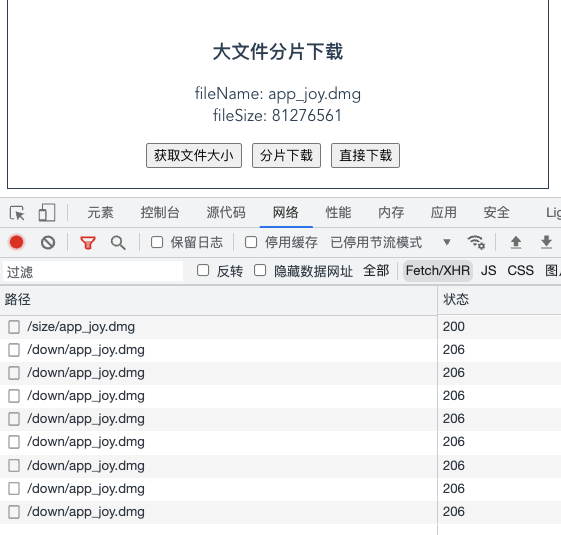

## 大文件分片下载

### 原理

其实和大文件的分片上传原理一样，就是将一个大的文件对象进行切片，然后并发下载分片，最后再进行组装。

只是下载文件需要服务端进行文件的分片，客户端（浏览器）进行文件的组装合并。

#### HTTP 范围请求

分片下载文件需要用到一个 **HTTP 范围请求**：

> HTTP 协议范围请求允许服务器只发送 HTTP 消息的一部分到客户端。

范围请求在传送大的媒体文件，或者与文件下载的断点续传功能搭配使用时非常有用。如果在响应中存在 `Accept-Ranges` 首部（并且它的值不为 “none”），那么表示该服务器支持范围请求。

在一个 Range 首部中，可以一次性请求多个部分，服务器会以 multipart 文件的形式将其返回。如果服务器返回的是范围响应，需要使用 **206 Partial Content** 状态码。假如所请求的范围不合法，那么服务器会返回 **416 Range Not Satisfiable** 状态码，表示客户端错误。服务器允许忽略 Range 首部，从而返回整个文件，状态码用 200 。

#### Range 请求语法

```http
Range: <unit>=<range-start>-
Range: <unit>=<range-start>-<range-end>
Range: <unit>=<range-start>-<range-end>, <range-start>-<range-end>
Range: <unit>=<range-start>-<range-end>, <range-start>-<range-end>, <range-start>-<range-end>
```

- `unit`：范围请求所采用的单位，通常是字节（bytes）。
- `<range-start>`：一个整数，表示在特定单位下，范围的起始值。
- `<range-end>`：一个整数，表示在特定单位下，范围的结束值。**这个值是可选的，如果不存在，表示此范围一直延伸到文档结束。**



### 后端实现

后端主要实现两个接口：1. 获取文件大小；2. 下载文件分片

#### 1. 获取文件大小

```js
// 获取文件大小
router.get('/size/:name', (ctx) => {
  // 获取要下载文件的路径
  const filePath = path.resolve(__dirname, DOWNLOAD_DIR, ctx.params.name)
  console.log(filePath)
  // 获取文件的大小
  const size = fs.statSync(filePath).size || 0
  console.log('文件大小' + size)
  ctx.body = {
    msg: 'ok',
    data: size.toString(),
  }
})
```

#### 2. 下载文件分片

```js
// 下载文件分片
router.get('/down/:name', async (ctx) => {
  try {
    const fileName = ctx.params.name
    // 获取文件的路径和文件的大小
    const filePath = path.resolve(__dirname, DOWNLOAD_DIR, fileName)
    const size = fs.statSync(filePath).size || 0
    // 获取请求头的 Range 字段
    const range = ctx.headers['range']
    console.log({ range })
    //没有 Range 字段, 则不使用分片下载, 直接传输文件
    if (!range) {
      ctx.set({
        'Content-Disposition': `attachment; filename=${fileName}`,
      })
      ctx.response.type = 'text/xml'
      ctx.response.body = fs.createReadStream(filePath)
    } else {
      // 获取分片的开始和结束位置
      const bytesRange = range.split('=')[1]
      let [start, end] = bytesRange.split('-')
      start = Number(start)
      end = Number(end)

      // 分片范围错误
      if (start > size || end > size) {
        ctx.set({ 'Content-Range': `bytes */${size}` })
        ctx.status = 416
        ctx.body = {
          code: 416,
          msg: 'Range 参数错误',
        }
        return
      }

      // 开始下载分片
      ctx.status = 206
      ctx.set({
        'Accept-Ranges': 'bytes',
        'Content-Range': `bytes ${start}-${end ? end : size}/${size}`,
      })

      ctx.response.type = 'text/xml'
      ctx.response.body = fs.createReadStream(filePath, { start, end })
    }
  } catch (error) {
    console.log({ error })
    ctx.body = {
      code: 500,
      msg: error.message,
    }
  }
})
```

### 前端实现

#### 1. 获取待下载文件的大小

```js
    // 获取待下载文件的大小
    async getFileSize (name = this.fileName) {
      try {
        const res = await http.get(`/size/${name}`)
        this.fileSize = res.data.data
        return res.data.data
      } catch (error) {
        console.log({ error })
      }
    },
```

#### 2. 下载分片内容

```js
    /**
     * 下载分片内容
     * @param {*} start
     * @param {*} end
     * @param {*} i
     * @param {*} ifRange
     */
    async getBinaryContent (start, end, i, ifRange = true) {
      try {
        let options = {
          responseType: "blob",
        }
        // 如果需要分片下载，则加上 Range 请求头
        if (ifRange) {
          options.headers = {
            Range: `bytes=${start}-${end}`
          }
        }
        const result = await http.get(`/down/${this.fileName}`, options);
        return { index: i, data: result };
      } catch (error) {
        return {}
      }
    },
```

#### 3. 计算分片数量，并发下载分片内容

```js
    const CHUNK_SIZE = 10 * 1024 * 1024 // 一个分片10MB

		async onDownload () {
      try {
        // 根据文件大小和分片大小计算分片数量
        const fileSize = await this.getFileSize(this.fileName)
        const chunksCount = Math.ceil(fileSize / CHUNK_SIZE)
				// 使用 asyncPool 实现并发下载
        const results = await asyncPool(3, [...new Array(chunksCount).keys()], (i) => {
          const start = i * CHUNK_SIZE
          const end = i + 1 === chunksCount ? fileSize : (i + 1) * CHUNK_SIZE - 1
          return this.getBinaryContent(start, end, i)
        })
        results.sort((a, b) => a.index - b.index)
        // 根据分片结果数组构建新的 Blob 对象
        const buffers = new Blob(results.map((r) => r.data.data))
        // 文件合并与下载
        saveFile(this.fileName, buffers)
      } catch (error) {
        console.log({ error })
      }
    },
```

上面使用 asyncPool 实现文件分片的并发下载，该函数具体实现为：

```js
async function asyncPool(poolLimit, array, iteratorFn) {
  const allTask = [] // 存储所有的异步任务
  const executing = [] // 存储正在执行的异步任务
  for (const item of array) {
    // 调用 iteratorFn 函数创建异步任务
    const p = Promise.resolve().then(() => iteratorFn(item, array))
    allTask.push(p) // 保存新的异步任务

    // 当 poolLimit 值小于或等于总任务个数时，进行并发控制
    if (poolLimit <= array.length) {
      // 当任务完成后，从正在执行的任务数组中移除已完成的任务
      const e = p.then(() => executing.splice(executing.indexOf(e), 1))
      executing.push(e) // 保存正在执行的异步任务
      if (executing.length >= poolLimit) {
        await Promise.race(executing) // 等待较快的任务执行完成
      }
    }
  }
  return Promise.all(allTask)
}
```

saveFile 函数主要是创建 a 链接进行文件下载：

```js
const saveFile = (name, buffers, mime = 'application/octet-stream') => {
  const blob = new Blob([buffers], { type: mime })
  const blobUrl = URL.createObjectURL(blob)
  const a = document.createElement('a')
  a.download = name
  a.href = blobUrl
  a.click()
  URL.revokeObjectURL(blob)
}
```

### 使用效果



我们下载一个 81276561 byte 大小的文件，一个分片设置为 10 _ 1024 _ 1024 byte 大小。可以看到一共发了 8 个请求下载分片内容。

**源码：**

前端：[front-end/BigFileDownload.vue at master · RJM1996/front-end (github.com)](https://github.com/RJM1996/front-end/blob/master/demo/file-uploadAndDownload/client/src/components/download/BigFileDownload.vue)

后端：[front-end/app.js at master · RJM1996/front-end (github.com)](https://github.com/RJM1996/front-end/blob/master/demo/file-uploadAndDownload/server/app.js)

**参考文章：**

[JavaScript 中如何实现大文件并行下载？ - 掘金 (juejin.cn)](https://juejin.cn/post/6954868879034155022#heading-0)

[手摸手，带你完成大文件分片下载 - 掘金 (juejin.cn)](https://juejin.cn/post/7025885508748181512)
