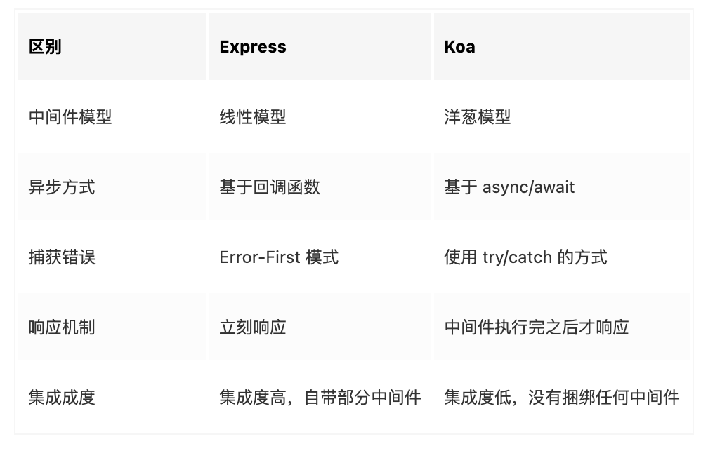
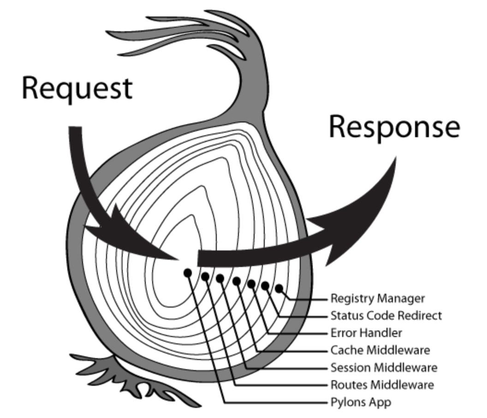

## 简历知识点梳理

### 1、Vue 相关

### 2、React 相关

### 3、Node.js 相关

#### 3.1 Express 和 Koa 的区别

`Express` 是一个基于` Node.js` 平台的 `web` 应用开发框架。而 `Koa` 则是 `Express` 的升级版： `Koa` 诞生之初正值 `Nodejs` 推出 `async/await` 语法之时， `Koa` 采用这种新的语法特性，丢弃回调函数，实现了了一个轻量优雅的 `web` 后端框架。
两者都采用中间件方式进行开发，并且相关 `api` 基本是大同小异的。



#### 3.2 怎么理解中间件

**Koa 中，中间件就是普通的函数，该函数接收两个参数：`context` 和 `next`**

其中 `context` 表示上下文对象，而 `next` 表示一个调用后返回 Promise 对象的函数

在 Koa 中，我们创建 Koa 应用程序对象之后，就可以通过调用该对象的 `use` 方法来注册中间件：

```javascript
const Koa = require('koa')
const app = new Koa()

app.use(async (ctx, next) => {
  const start = Date.now()
  await next()
  const ms = Date.now() - start
  console.log(`${ctx.method} ${ctx.url} - ${ms}ms`)
})
```

#### 3.3 什么是洋葱模型



上图中，洋葱内的每一层都表示一个独立的中间件，用于实现不同的功能，比如异常处理、缓存处理等。

每次请求都会从左侧开始一层层地经过每层的中间件，当进入到最里层的中间件之后，又会从最里层的中间件开始逐层返回。

因此对于每层的中间件来说，在一个 **请求和响应** 周期中，都有两个时机点来添加不同的处理逻辑。

### 4、Blob.slice 大文件分片上传

**`Blob.slice() `** 方法用于创建一个包含源 [`Blob`](https://developer.mozilla.org/zh-CN/docs/Web/API/Blob)的指定字节范围内的数据的新 [`Blob`](https://developer.mozilla.org/zh-CN/docs/Web/API/Blob) 对象

1. file.slice 文件分片
2. spark-md5 生成文件唯一标识
3. 查询文件在服务器上是否存在
4. 上传文件分片，使用 asyncPool 实现并发控制
5. 通知服务器合并文件

### 5、require.context 自动引入文件

可以给该函数传入三个参数

1. 一要搜索的目录
2. 一个标记，表示是否还搜索其子目录
3. 一个匹配文件的正则表达式。

Webpack 会在构建中解析代码中的 `require.context()`

```js
require.context(directory, (useSubdirectories = true), (regExp = /^\.\/.*$/), (mode = 'sync'))
```

如果想引入一个文件夹下面的所有文件，或者引入能匹配一个正则表达式的所有文件，这个功能就会很有帮助。例如：

匹配指定目录下的所有 mock 文件并自动引入

```js
// 匹配 @/mock/modules 目录下所有以 .mock.js 结尾的文件, 自动引入
const context = require.context('./modules', true, /\.mock.js$/)
context.keys().forEach((key) => {
  const module = context(key)
  Object.keys(module).forEach((apiName) => {
    // console.log(apiName, module[apiName])
    const mockMap = module[apiName] // 一个mock映射对象
    let { url, urlReg, method, func } = mockMap
    if (urlReg) {
      // 使用正则表达式做映射
      Mock.mock(urlReg, method, func)
    } else {
      // 使用url字符串做映射
      // 如果url是绝对路径,就不采用mock
      if (url?.indexOf('http://') === -1) {
        if (Object.keys(mockMap).length === 2) {
          Mock.mock(url, func)
        } else if (Object.keys(mockMap).length === 3) {
          if (['get', 'GET'].includes(method)) {
            url = new RegExp(url + '.*')
          }
          Mock.mock(url, method, func)
        }
      }
    }
  })
})
```

### 6、前端分离部署

#### 分离前：

1. 前端打包生成 dist 文件夹
2. 打包后的文件拷贝到后端项目的静态目录下，然后 push 代码
3. 后端拉取代码，由后端进行 Nginx 部署
4. 发现问题，修改后，又重复以上步骤

#### 分离后：

1. 在服务器上单独配置一个前端项目的 Nginx server
2. 前端执行脚本 build.sh，自动生成打包文件并上传到服务器

使得联调部署效率大大提升。

### 7、编写 Cli 工具自动创建新项目

1. 使用 [commander.js](https://github.com/tj/commander.js/blob/master/Readme_zh-CN.md) 来处理命令行参数
2. 使用 [inquirer]([SBoudrias/Inquirer.js: A collection of common interactive command line user interfaces. (github.com)](https://github.com/SBoudrias/Inquirer.js)) 给用户几个选择，处理用户交互
3. 使用 [download-git-repo]([Phillip Lanclos / download-git-repo · GitLab](https://gitlab.com/flippidippi/download-git-repo#readme)) 下载远程仓库的代码
4. 使用 [shelljs]([shelljs/shelljs: Portable Unix shell commands for Node.js (github.com)](https://github.com/shelljs/shelljs)) 来执行 shell 命令，自动安装项目依赖

### 8、bpmn-js 相关

[bpmn.js](https://bpmn.io/) 是一个 BPMN2.0 渲染工具包和 web 建模器，使得绘制流程图的功能在前端来完成

而决策引擎这个项目的核心功能决策流的绘制就是使用 bpmn 来完成的。

[全网最详细的 bpmn 中文教程](https://juejin.cn/post/6844904017567416328)

主要实现：

1. 自定义工具栏
2. 自定义节点操作面板
3. 自定义节点渲染器，节点使用 SVG 进行绘制
4. 实现决策流查看模式
5. 支持导出 JSON 和 XML 文件供后端进行解析

使得用户可通过拖拽方式快速创建决策流，对于决策流的理解也更加形象直观

### 9、动态表格表单的封装，使用自定义指令进行性能优化

结合 Form 和 Table 组件，使用 slot 对单元格进行自定义渲染，同时使用自定义指令对表单项渲染进行优化，避免输入卡顿。

基本思路：

1. 组件接收 `columns` 属性用于表头的渲染，接收 `formList` 属性，遍历每一项，根据每一项的 type 进行自定义单元格的渲染
2. 渲染列表的数据为一个数组，新增一行就是往数组中 push 一项，删除时根据 index 删除一项
3. 单元格初始为一个 span 标签，使用了自定义指令 v-field，传入 value 和 input 事件处理函数，模拟双向绑定；
4. 首先获取 span 标签的父元素，当单击父元素时，创建一个 input 元素，赋值 value，并隐藏 span 元素；
5. 输入完成，触发 blur 事件或者回车事件时，销毁 input 元素，展示 span 元素。因此页面上不会同时存在大量输入框，避免输入卡顿

Vue 自定义指令[自定义指令 — Vue.js (vuejs.org)](https://cn.vuejs.org/v2/guide/custom-directive.html)

### 10、基础组件封装

#### SearchTable

结合查询表单和 Table 列表展示，将查询列表常用的功能集中封装，减少重复代码。例如：

- 点击查询按钮、翻页、排序时触发查询接口
- Table 的 loading 效果，多选功能
- 列表的导出功能

封装后只需传入一些查询列表必要的参数：例如：`searchFormList`、`columns`、`list`

然后暴露出一个 onSearch 方法，当点击查询按钮、翻页、排序时都会触发，在 onSearch 方法中拿到查询参数，调用查询接口更新数据即可

#### Form

接收一个名为 formList 的 props，是一个对象数组，数组每一项就是一个表单项的渲染配置，例如：

```js
	{
    label: '正则化系数',
    name: 'cnum',
    type: 'select',
    range: '(0,inf)',
    required: true,
    allowClear: false,
    permission: 'all',
    optimizeParam: {
      isOptimize: false
    }
  }
```

包含 label、name、type 等字段，添加不同的配置属性即可新增对应的功能。

例如 range 属性的功能即为自定义该字段取值范围。通过自定义校验函数 validator 编写了一系列灵活的自定义校验规则，很好地满足了业务需求。

将表单的校验、提交、重置、事件绑定、数据回填等逻辑在内部统一封装，外部使用时按需传入对应的属性或调用对应的方法即可，减少了大量重复代码的编写。

```jsx
<FormUI
  cascade
  ref={refFormUI}
  layout={layout}
  formListData={formList}
  openItems={openItems}
  itemChange={onItemChange}
  onSwitchChange={onSwitchChange}
/>
```

使用封装好的组件，只需少量代码即可生成一个复杂的表单页面

### 11、React Hooks 相关

#### 1. useReducer 和 useContext 的使用

`useReducer + React.createContext() + useContext` 实现一个局部的 redux

```js
// useReducer
const [state, dispatch] = useReducer(reducer, initState)

// React.createContext()
export const TaskContext = React.createContext()
<TaskContext.Provider value={{ state, dispatch }}>
...
</TaskContext.Provider>

// useContext
const { state, dispatch } = useContext(TaskContext)
const {
    activeNode,
    pageType,
    algType,
    algName,
    taskStatus,
    detailData,
    stepTaskId,
    stepSourceId,
} = state
```
