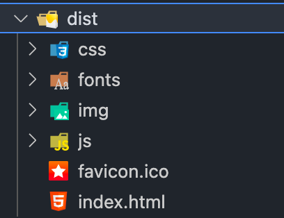

## 什么是部署?
简单来说就是你的电脑上有一些资源，通过部署后，其他人通过一个地址可以访问到这些资源。

例如: 你有一台拥有公网 IP 地址的服务器，你在这台服务器上通过 npm start 运行了一个你的前端应用，外网的

人就可以使用 ip:port 来访问你这个应用，这就可以称之为部署。

### 使用 npm run dev 部署

平常开发时我们都是通过 `npm run dev` 在本地启动项目，这就相当于在本地部署了我们的前端应用。

一个前端应用包含的资源不外乎 html、css、js、图片等文件。部署就是把这些文件放到一个服务器中，浏览器通过访问这个服务器的地址，就可以请求到这些文件，然后在浏览器中进行渲染执行。

```js
const http = require('node:http')
const fs = require('node:fs')

// 读取html文件获取内容
const html = fs.readFileSync('./index.html')

const server = http.createServer((req, res) => res.end(html))

server.listen(3000, () => {
  console.log('Listening 3000')
})
```

上述代码就是将 index.html 进行了部署，运行代码后，就可以在浏览器访问 ` localhost:3000` 获取 index.html 文件内容。

但是上述这种静态资源服务器的功能是不完善的，性能也存在问题，市面上有一些更专业的静态资源服务器（例如 Nginx），可以专门用于部署我们的前端项目。


### 使用 nginx 部署

打开 nginx 的配置文件 nginx.conf

```nginx
  server {
    listen 9096;
    location / {
      root /usr/local/nginx/html;
      index index.html;
      try_files $uri $uri/ /index.html;
      if ($document_uri ~ .(eof|ttf|ttc|otf|eof|woff|woff2|svg)) {
        add_header Access-Control-Allow-Origin *;
      }
    }
    location ^~/api/ {
      proxy_pass http://127.0.0.1:8000/; # 后端接口服务器地址
    }
  }
```

上述配置主要做了以下几件事：

1. 监听 9096 端口
2. 将 /usr/local/nginx/html 目录作为一个静态资源服务
3. 设置首页地址，并将无法匹配的地址重定向到 index.html
4. 对指定后缀的文件设置允许跨域的 http header
5. 将 /api 前缀的请求代理到指定的服务器地址

我们一般使用 vue-cli 和 create-react-app 等脚手架，执行 npm run build 生成打包文件 dist，这个 dist 就是我们需要部署的静态资源文件。




参考上面的配置，我们只需要把 /usr/local/nginx/html 换成 dist 目录即可，也就是把 dist 拷贝到 /usr/local/nginx/html 中，将 root 设置为 /usr/local/nginx/html/dist

```nginx
root /usr/local/nginx/html/dist;
index index.html;
```

这样我们就使用 Nginx 部署好了一个前端项目


### 使用 docker

项目部署时往往需要各种不同的环境，例如不同的 node 版本，不同的语言，如果在部署的机器上全部安装会非常麻烦。如果有一个工具可以提供一个隔离的环境，并且其中可以安装项目需要的各种依赖，就不用担心各种依赖版本的问题了。 **Docker** 就是为此而生的。

假设你有三个后端服务，分别用 Java、Go、Node 编写，你需要在服务器分别安装三者的环境，才能运行所有语言编写的代码，这对于开发者而言非常麻烦。

假设你有三个 Node 服务，分别用 node10、node12、node14 编写，你需要在服务器分别安装三个版本 nodejs 才能运行各个版本 nodejs 编写的代码，对于开发者而言也非常麻烦。

而有了 Docker，就没有这种问题，它可单独提供某种语言的运行环境，并同时与宿主机隔离起来。

对于前端而言，你可以自己在项目中单独维护 `nginx.conf` 进行一些 nginx 的配置；编写 Dockerfile 指定运行环境，自动部署。大大提升前端的自由性和灵活度，摆脱后端和运维的枷锁。

在 docker 中有**镜像**和**容器**的概念，举个例子：镜像就像是**类（class）** ，而容器就像是**类的实例**

一个镜像中包含一系列项目需要的运行环境，基于一个镜像可以运行多个容器。运行起来的这个容器就是我们的应用，**容器即应用！**


参考资料：[专栏介绍 | 前端部署十五篇)](https://q.shanyue.tech/deploy/)


